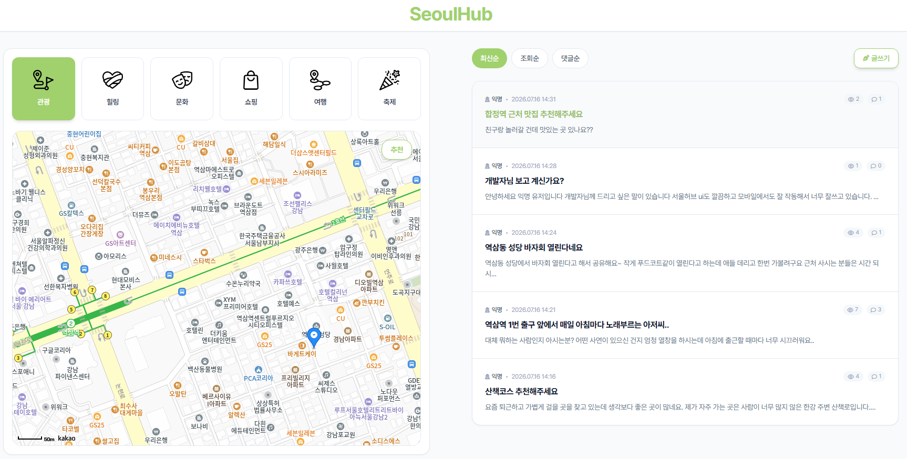

# 🏙️ SeoulHub

> **서울 여행을 더 쉽고, 더 편리하게.**  
> 서울시 공공데이터를 활용하여 관광지, 문화시설, 레포츠, 쇼핑, 여행코스, 축제 정보를 한곳에서 제공하는 통합 관광 플랫폼입니다.

🌐 **Service** : https://seoulhub.netlify.app


---

## 📖 프로젝트 소개

서울시에서는 관광, 문화시설, 축제 등 다양한 공공데이터를 제공하고 있지만,
사용자가 필요한 정보를 한곳에서 탐색하고 다른 사람들과 경험을 공유할 수 있는 서비스는 부족하다고 판단했습니다.

SeoulHub는 서울시 공공데이터와 AI 챗봇, 익명 커뮤니티를 결합하여
서울의 다양한 지역 정보를 쉽고 편리하게 탐색하고 공유할 수 있도록 제작한 서비스입니다.

지역별·카테고리별 관광 정보를 제공하며,
지도 기반 위치 확인과 상세 정보 조회를 통해
서울 여행을 계획하는 사용자에게 편리한 경험을 제공합니다.

서울시의 관광 관련 공공데이터를 활용하여 관광지, 문화시설, 레포츠, 쇼핑, 여행코스, 축제 정보를 제공합니다.

---

## ✨ 주요 기능

- 📍 카테고리별 관광 정보 조회
  - 관광지
  - 문화시설
  - 레포츠
  - 쇼핑
  - 여행코스
  - 축제

- 🗺️ 지도 기반 위치 확인

- 🎲 랜덤 장소 추천 기능

- 🤖 관광과 관련된 질문에 답변하는 AI 챗봇 기능

---

## 🚀 실행 방법

### Frontend

```bash
npm install
npm run dev
```

### Backend

```bash
pip install -r requirements.txt
uvicorn app.main:app --reload
```

---

## 👥 Team

| 역할 | 담당 |
|------|------|
| Frontend | 고아라 |
| Backend | 김원희 |

---

## 🔗 Service

**https://seoulhub.netlify.app**
